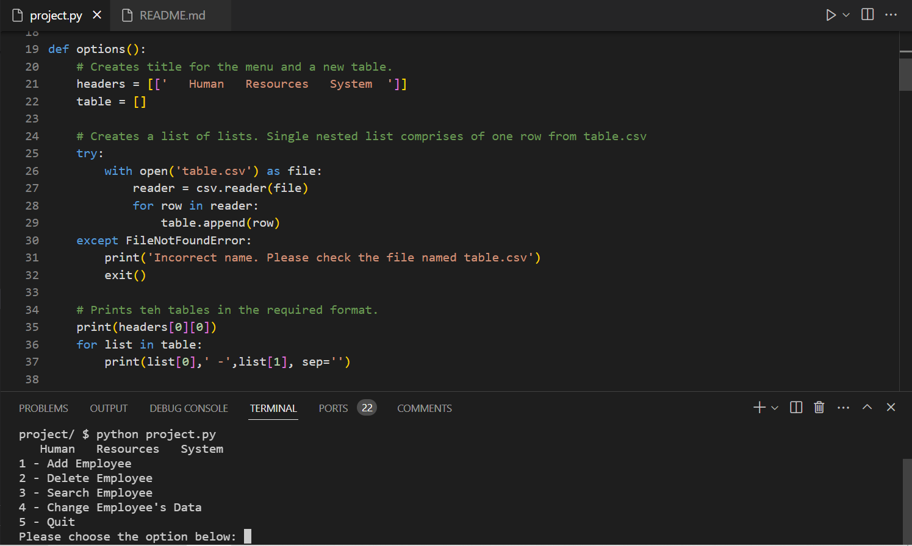
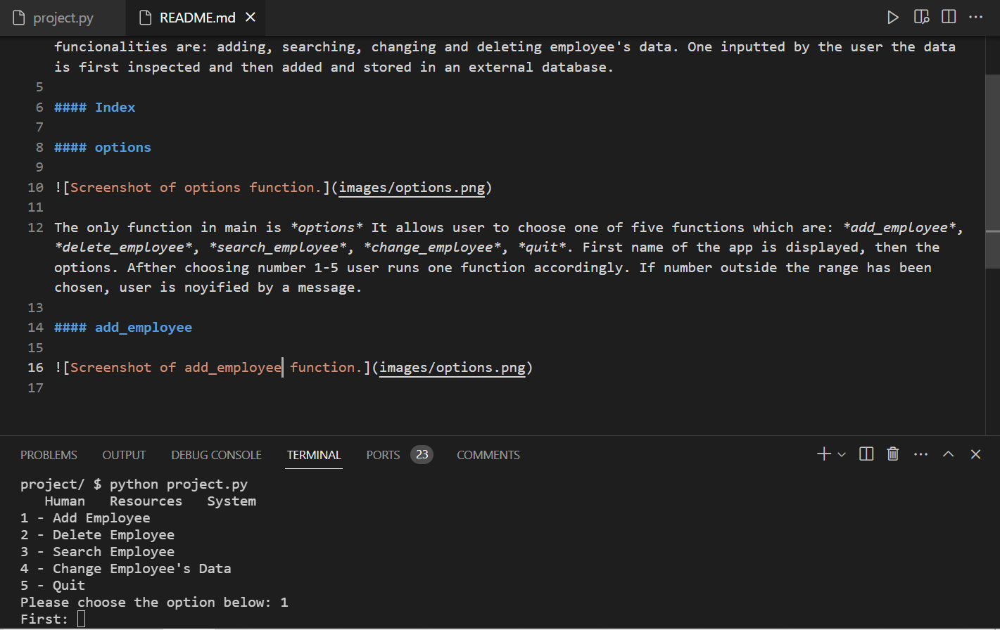
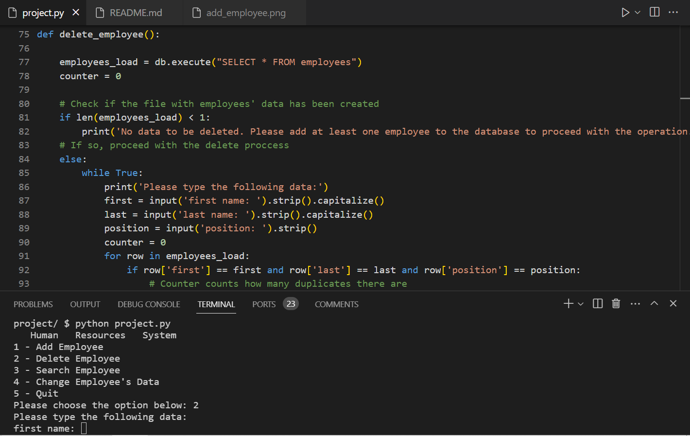
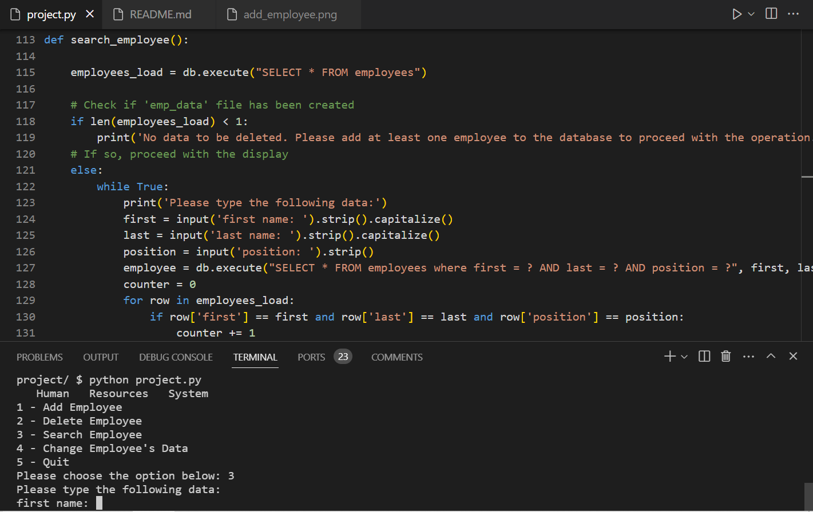
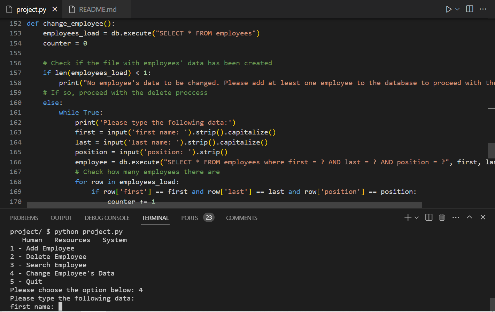

# HRS - Human Resources System
#### Video Demo:  https://youtu.be/xXRrWv90zJ0
#### Description:
HRS - Human Resources System is a Python program that allows easy management of human resources. The main funcionalities are: adding, searching, changing and deleting employee's data. One inputted by the user the data is first inspected and then added and stored in an external database.

#### Index

#### options

The only function in main is *options* It allows user to choose one of five functions which are: *add_employee*,  *delete_employee*, *search_employee*, *change_employee*, *quit*. First name of the app is displayed, then the options. Afther choosing number 1-5 user runs one function accordingly. If number outside the range has been chosen, user is notified by a message.

#### add_employee

The *add_employee* function first ask user to type in first name, last name, address, city , telephone number, grade, position and unit. Then inside a SQL statement user is added to the database with unique number. Then user is asked if he wants to add another employee, if yes the whole process repeats, if not he returns to main screen.

#### delete_employee

The *search_employee* function first ask user to type in first name, last name and position. Then the function checks with the database how many people with the provided data there are. If 0, the follofing message is displayed: 'No employee matches your search. Do you want to try again (Y/N)?'. If 1, inside a SQL statement user is deleted from the database and a message is displayed: 'Employee has been sucessfully deleted'. If there're more employees than 1, the following message is displayed: 'Too many employees with the same position, first and last name have been added. Error!' and the program quits.

#### search_employee

If there ane less employess yhan 1, it won't work and the following message will appear: 'No data to be deleted. Please add at least one employee to the database to proceed with the operation.'. The *search_employee* function first ask user to type in first name, last name and position. Then the function checks with the database how many people with the provided data there are. If 0, the follofing message is displayed: 'No employee matches your search. Do you want to try again (Y/N)?'. If 1, a SQL statement searches for the employee and diplays both keys and values in a desired format in a loop. If there're more employees than 1, the following message is displayed: 'Too many employees with the same position, first and last name have been added. Error!' and the program quits.

#### change_employee

If there ane less employess yhan 1, it won't work and the following message will appear: 'No data to be changed. Please add at least one employee to the database to proceed with the operation.'The *change_employee* function first ask user to type in first name, last name and position. Then the function checks with the database how many people with the provided data there are. If 0, the follofing message is displayed: 'No employee matches your search. Do you want to try again (Y/N)?'. If 1, a SQL statement searches for the employee and diplays both keys and values in a desired format in a loop. Then the user is asked what parameter he would like to change and to what value. Then a SQL statement is run to change the data and the following ,message is displayed: "{first} {last}'s {data} has been sucessfully changed to {value}.". If there're more employees than 1, the following message is displayed: 'Too many employees with the same position, first and last name have been added. Error!' and the program quits.

#### quit

The *quit* function quits the program.